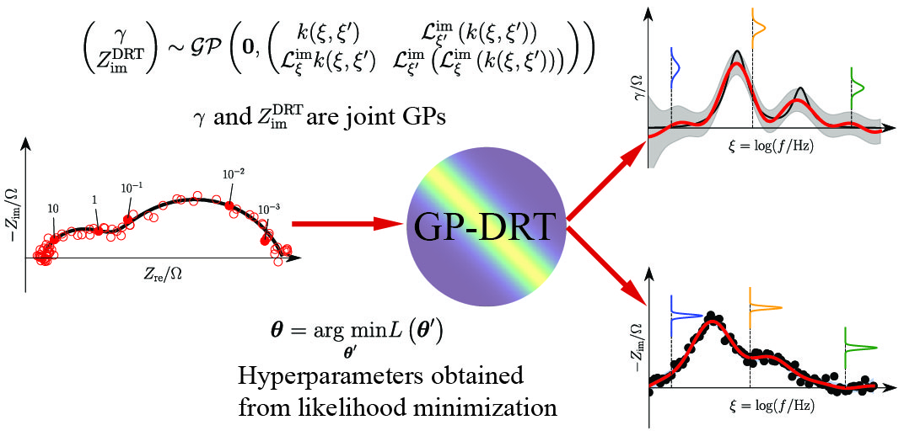

# Project
GP-DRT: Gaussian Process Distribution of Relaxation Times

This repository contains some of the source code for the paper "The Gaussian Process Distribution of Relaxation Times: A Machine Learning Tool for the Analysis and Prediction of Electrochemical Impedance Spectroscopy Data" <u>https://doi.org/10.1016/j.electacta.2019.135316</u>, which is also available in the [docs](docs) folder.

# Introduction
Distribution of relaxation times (DRT) [1] method offers an elegant solution to analyze the electrochemical impedance spectroscopy (EIS) data encountered in material science, electrochemistry, and other related fields. However, deconvolving the DRT from the EIS data is an ill-posed problem [2-3], which is particularly sensitive to experimental errors. Several well-known approaches [2-5] can overcome this issue but they all require the use of ad hoc hyperparameters. Furthermore, most methods are not probabilistic and therefore do not provide any uncertainty on the estimated DRT. GP-DRT [6] is our newly developed approach that is able to obtain both the DRT mean and covariance from the EIS data, it can also predict the DRT and the imaginary part of the impedance at frequencies not previously measured. The most important point is that the parameters that define the GP-DRT model can be selected rationally by maximizing the experimental evidence. The GP-DRT approach is tested with both synthetic experiments and “real” experiments, where the GP-DRT model can manage considerable noise, overlapping timescales, truncated data, and inductive features.


<div align='center'><strong>Figure 1. Schematic illustration of the GP-DRT framework.</strong></div>

# Dependencies
`numpy`

`scipy`
 
`matplotlib`


# Tutorials

* **ex1_simple_ZARC_model.ipynb**: shows how to recover DRT from impedance synthesized using one ZARC element consisting of a resistance placed in parallel to a constant phase element (CPE). The frequency range is from 1E-4 Hz to 1E4 Hz with 10 points per decade (ppd).

* **ex2_double_ZARC_model.ipynb**: shows how the GP-DRT model can manage the overlapping timescales from two ZARC elements in series. The frequency range is from 1E-4 Hz to 1E4 Hz with 10 points per decade (ppd).

* **ex3_truncated_ZARC_model.ipynb**: shows how the GP-DRT model can recover the DRT from the truncated impedance, whose data points at lower frequencies (f < 1E-3 Hz) are not available, and predict the impedance value at these `unmeasured` frequency points.

# Citation

```
@article{liu2019gaussian,
  title={The Gaussian process distribution of relaxation times: A machine learning tool for the analysis and prediction of electrochemical impedance spectroscopy data},
  author={Liu, Jiapeng and Ciucci, Francesco},
  journal={Electrochimica Acta},
  pages={135316},
  year={2019},
  publisher={Elsevier}
}
```

# References
1. Ciucci, F. (2018). Modeling electrochemical impedance spectroscopy. Current Opinion in Electrochemistry.132-139 [doi.org/10.1016/j.coelec.2018.12.003](https://doi.org/10.1016/j.coelec.2018.12.003)
2. Wan, T. H., Saccoccio, M., Chen, C., & Ciucci, F. (2015). Influence of the discretization methods on the distribution of relaxation times deconvolution: implementing radial basis functions with DRTtools. Electrochimica Acta, 184, 483-499. [doi.org/10.1016/j.electacta.2015.09.097](https://doi.org/10.1016/j.electacta.2015.09.097)
3. Saccoccio, M., Wan, T. H., Chen, C., & Ciucci, F. (2014). Optimal regularization in distribution of relaxation times applied to electrochemical impedance spectroscopy: ridge and lasso regression methods-a theoretical and experimental study. Electrochimica Acta, 147, 470-482. [doi.org/10.1016/j.electacta.2014.09.058](https://doi.org/10.1016/j.electacta.2014.09.058)
4. Effat, M. B., & Ciucci, F. (2017). Bayesian and hierarchical Bayesian based regularization for deconvolving the distribution of relaxation times from electrochemical impedance spectroscopy data. Electrochimica Acta, 247, 1117-1129. [doi.org/10.1016/j.electacta.2017.07.050](https://doi.org/10.1016/j.electacta.2017.07.050)
5. Ciucci, F., & Chen, C. (2015). Analysis of electrochemical impedance spectroscopy data using the distribution of relaxation times: A Bayesian and hierarchical Bayesian approach. Electrochimica Acta, 167, 439-454. [doi.org/10.1016/j.electacta.2015.03.123](https://doi.org/10.1016/j.electacta.2015.03.123)
6. Liu, J., & Ciucci, F. (2019). The Gaussian process distribution of relaxation times: A machine learning tool for the analysis and prediction of electrochemical impedance spectroscopy data. Electrochimica Acta, 135316. [doi.org/10.1016/j.electacta.2019.135316](https://doi.org/10.1016/j.electacta.2019.135316)
